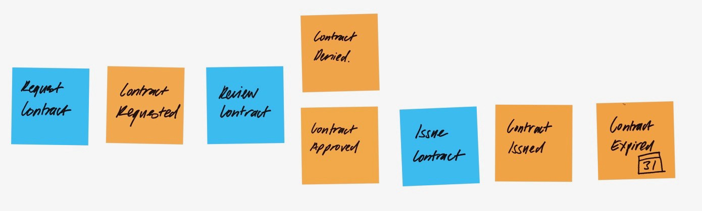

# Why software development starts with sticky notes

When starting a software development project, there’s usually a story about how the existing solution grew into its current form. While that story can be informative, it’s important to clear the slate and design according to current, actual needs. Event Storming is an excellent tool for use in the discovery process to allow software developers to ask questions, and to give domain experts an opportunity to explain their process.

One of the reasons why **Event Storming is so powerful is that it untangles the process from the solution**. If something is being done a certain way to accommodate a less-than-efficient tool, the actual need should be identified separately so that a better, more efficient tool can be created.

Created by [Alberto Brandolini](http://ziobrando.blogspot.com/), Event Storming looks like a bunch of sticky notes on a big piece of butcher paper on a huge wall. The idea is to provide plenty of space and minimal constraints to allow ideas to flow. Using sticky notes allows items to be rearranged easily as connections are identified and possibilities are explored. Event Storming isn’t a sit-down meeting. It’s a stand-up, interactive question and answer / brainstorming session. The objective is to identify the **domain events** that need to be supported by the software solution.

## What is a domain event?

A domain event (orange) is something that happens, such as *Policy Expired*. The explanation must be short and simple, and written in the past tense. It’s often easiest to start at the end and work backward, for example from *Contract Expired* back to *Contract Issued*. As the domain expert explains a process, it can be broken down into individual events. Other domain experts in the room can contribute their versions of the same process or different iterations of similar processes.

Events are independent of the process. It doesn’t matter how something happens; it’s what happens that’s important. For example, it doesn’t matter if a contract is renewed online, over the phone or in person. The event is still *Contract Renewed*. Whenever the conversation becomes too steeped in how the system currently works, a good question to ask is, “What information do you need?”

As events are captured, they can be re-evaluated to ensure that they align with business objectives. Is everything necessary? What outcome is required? Well-defined events allow the new process to be optimized and automated where it makes the most sense to do so.

## What triggers an event?

Event Storming also identifies internal and external triggers that result in events. Events are mapped out first, and then the **actions** (blue) that trigger those events are added in. Actions are defined in present tense; for example, *Request Contract*. However, some events may occur simply by the passing of time; for example, *Contract Expired*.

## What’s needed for Event Storming success

One of the valuable benefits of Event Storming is that it allows stakeholders with domain knowledge to be personally involved in defining the events and triggers together. No matter which department someone comes from, everyone has shared goals of removing inefficiencies and getting more done, faster. If they can identify roadblocks and unnecessary steps and eliminate them from the process, it’s a shared win.

Having the right people in the room is essential. While domain knowledge is important, people who are open-minded and willing to try to see alternate options can be more useful than someone who knows the system inside and out, but is completely against making any changes to the way things are done. Anyone who has ever been to a brainstorming session knows how surprising it can be to see who is and isn’t able to make valuable contributions.

Defining critical business process elements on sticky notes may seem like a casual approach, but it’s like genius ideas scrawled on napkins. The **Event Storming approach encourages inspiration, creativity, and collaboration**, and forms the framework for beautifully designed code that supports the true objectives of each business.