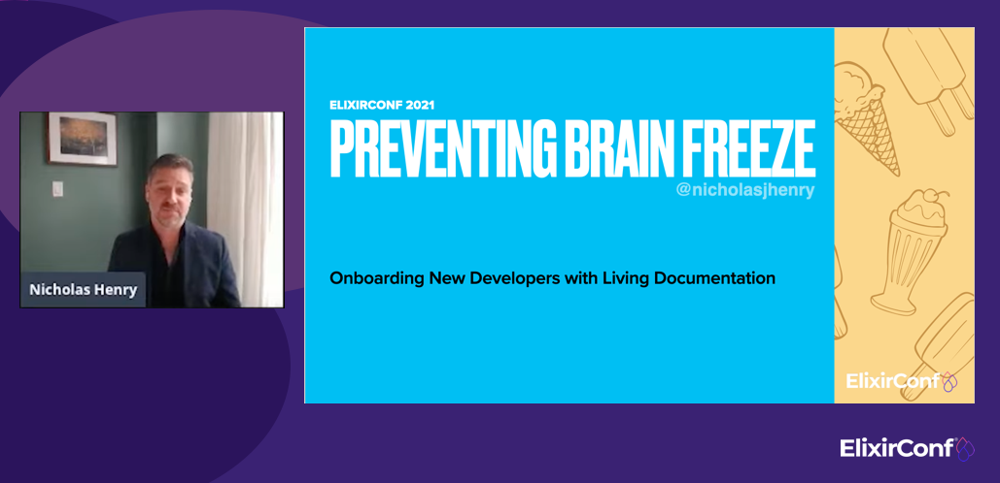
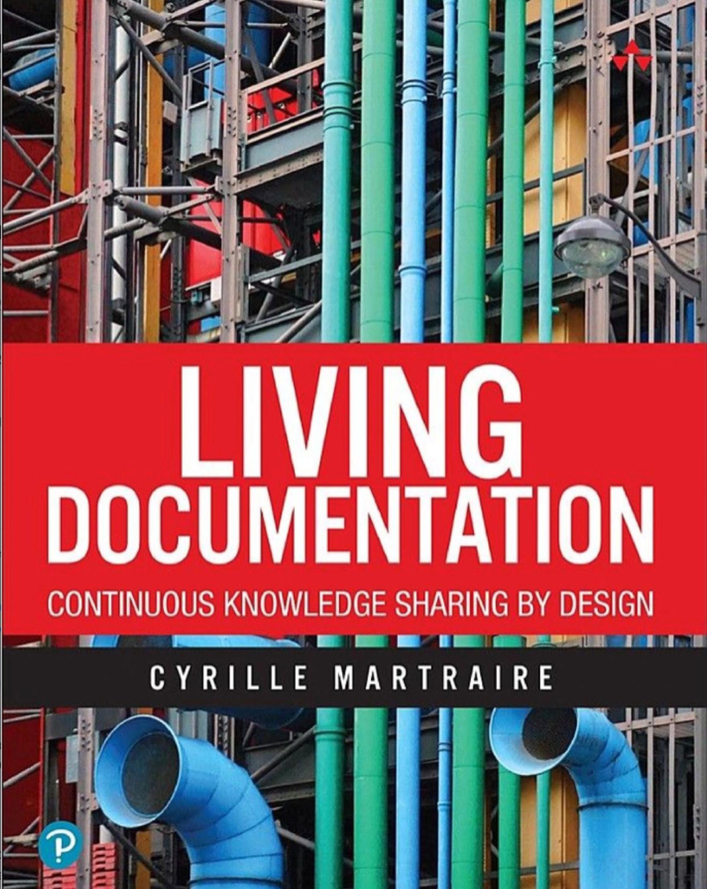

# Preventing Brain Freeze - Onboarding new developers with Living Documentation

_This series of blog posts is an extract from the script for my talk presented at [ElixirConf 2021](https://www.elixirconf.com/#nicholas-henry)._

1. **Onboarding new developers with Living Documentation**
2. Knowledge Sharing: Leading and Lagging Indicators (to be published)
3. Living Documentation in Elixir (to be published)
4. Leverage your source code (to be published)
5. Augment your source code (to be published)
6. Curate your source code (to be published)
7. Getting Started (to be published)

---

## Talk abstract

Your first contribution to an existing in-house application can be like eating ice cream too quickly
on a hot summer’s day – your excitement and enthusiasm result in a painful headache as you struggle
to understand the domain and navigate the codebase. Elixir and the surrounding ecosystem have an
excellent reputation for beautiful documentation and onboarding tools, but these practices don’t
always migrate to in-house applications hidden from public view.

Together, we’ll discover the principles and practices of living documentation and how Elixir’s
tooling supports its implementation. At the end of the presentation, you’ll leave with a set of
techniques and methods to elevate your application’s onboarding experience to prevent the next ice
cream headache.

## Onboarding: introducing a newly hired developer to a project

Onboarding is typically thought of as *the process of introducing a newly hired employee into an
organization*. In the context of software development, we can consider onboarding to be *the process
of introducing a newly hired developer to a project*.

## The problem and solution domains

We can map the onboarding journey for a developer to two main domains:

1. The **problem domain**: where the developer learns about the business
2. The **solution domain**: where the developer learns about the source code’s architecture and
   conventions

To onboard new developers in these two domains requires an effective knowledge sharing process.

## Onboarding is knowledge sharing

As new developers of a team, we should always try to pair with our teammates. If you are an
existing team member onboarding a new developer and need to perform a code review, perhaps
consider asking the author to walk through the code with you. You'll be amazed by how many
corrections they discover by themselves.

However, in-person knowledge sharing is not always possible, so we need to lean on other methods,
especially when working with code that was perhaps authored in isolation or the author is no
longer on the team. As software developers, we hope that the source code tells us everything
about a project. Still, unfortunately, it doesn't tell us the whole story, especially the design
decisions made over the application's lifetime.

**Documentation is a method for asynchronous knowledge sharing** when in-person knowledge sharing is
not possible. Before you quickly switch to another track to checkout another talk, we are not
talking about a traditional documentation approach.

## The downfalls of traditional documentation

Documentation does have a bad rap, and rightfully so:

1. Duplicated documentation may exist across multiple sources, separate from the codebase.
2. Large documentation efforts slow down or put feature development on hold.
3. Documentation can yield a low return on investment; often, we document the wrong things, where
   naming conventions might be better a tactic.

Traditional documentation hinders knowledge sharing with new developers; it doesn't enable it. *What
is the alternative to traditional documentation?*

## Living Documentation as an alternative

We want to focus on reliable documentation, low effort, collaborative and insightful. These
are the four principles that *Cyrille Martraire* laid out in his book [Living Documentation, a book
about continuous knowledge sharing](https://www.google.ca/books/edition/Living_Documentation/IhACtAEACAAJ).

1. **Reliable** documentation is accurate and in sync with the software being delivered. That's why it
   is crucial to leverage, augment and curate the project's source code.
2. **Low Effort** documentation is the documentation you don't have to write or has little
   maintenance. We leverage naming, conventions, and typespecs to communicate in your codebase.
3. **Collaborative** documentation encourages everybody to contribute to it, but at the very least,
   gives everybody access to read it.
4. **Insightful** documentation embeds learning of the business domain and architecture decisions. It
   acts as a reality check on your software design. Just like testing, if it's hard to document,
   perhaps you need to rethink your design.

And it will be Martraire's concepts and patterns we'll be discussing today and how these patterns
can be applied to Elixir for async knowledge sharing with new developers.

## Leverage, augment and curate your source code for onboarding

Your project’s codebase is the authoritative source for knowledge of the problem and solution
domains. The two domain new developers are learning when onboarding to a new project.

1. We want to **leverage** code as the foundation for living documentation
2. We want to **augment** code to add missing documentation to make it complete
3. We want to **curate** code to make the most essential concepts prominent

These three strategies will drive the structure for the rest of the presentation and how to apply
them to an Elixir project. But first, I want to talk about you. *Where do you find the motivation
and time to invest in knowledge sharing?*

---

Next: [Knowledge Sharing: Leading and Lagging Indicators]()