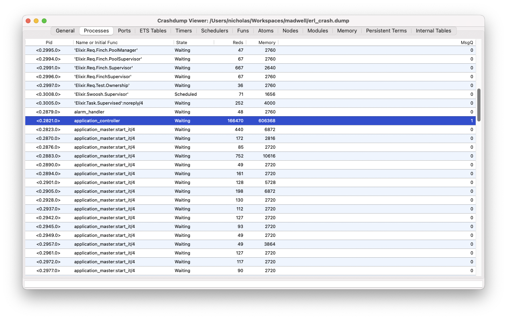
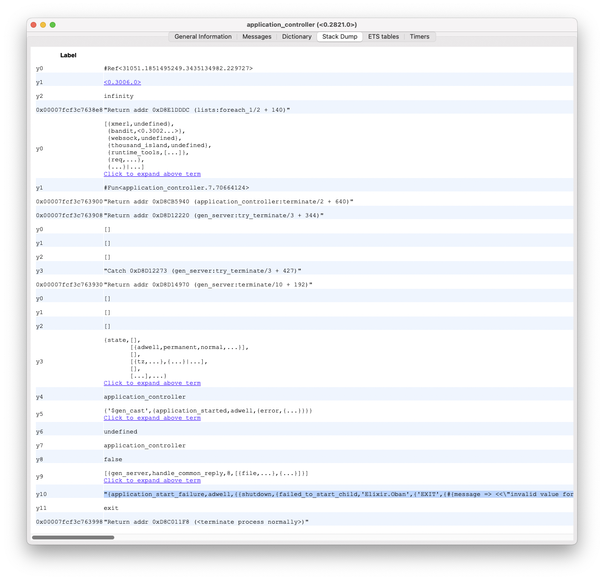

# Debugging with `erl_crash.dump`: A Practical Example from the Field


When working with Elixir releases in Docker, even small misconfigurations can cause crashes. Recently, I encountered an issue that perfectly illustrates how the `erl_crash.dump` can help pinpoint the problem. Here’s what happened:

## The Scenario

I was testing a build locally using an Elixir release packaged into a Docker image. When I ran the container, the application crashed with a typical error message that like this:

```
Runtime terminating during boot (terminating)

Crash dump is being written to: erl_crash.dump...done
```

(Your message may vary, but you’ll usually see a log indicating that the crash dump was created and that an application terminated unexpectedly.)

## Investigating the Crash Dump

### Step 1: Opening the Crash Dump

On my local file system, I opened the `erl_crash.dump` file using the built-in Erlang tool:

```elixir
:crashdump_viewer.start.
```

This tool provides a convenient interface for navigating through the dump file without having to manually sift through a massive text file.

### Step 2: Navigating to the `application_controller` Process

Within the crash dump viewer, I went to the **Processes** tab and selected the **application_controller** process. 

But why is the `application_controller` a good place to start?

- **Central Role:** The `application_controller` is responsible for starting and supervising applications. Any misconfiguration or error during startup often gets reflected here.
- **Early Indicator:** Since the crash occurred during application boot-up, examining the `application_controller` process often gives you insight into what failed to start correctly.
- **Stack Trace Clarity:** The stack trace associated with this process typically contains detailed information on the initialization flow, helping to pinpoint the misbehaving component.



### Step 3: Examining the Stack Trace

After selecting the `application_controller` process, I examined its stack trace. 



This is where the clue emerged. The stack trace included the following message:

```
"{application_start_failure,adwell,{{shutdown,{failed_to_start_child,'Elixir.Oban',{'EXIT',{#{message => <<\"invalid value for :plugins, invalid value for :crontab, MyApp.InvalidWorker not found or can't be loaded\">>,'__struct__' => 'Elixir.ArgumentError','__exception__' => true},[{'Elixir.Oban.Config',new,1,[{file,\"lib/oban/config.ex\"},{line,99}]},{'Elixir.Oban',start_link,1,[{file,\"lib/oban.ex\"},{line,464}]},{supervisor,do_start_child_i,3,[{file,\"supervisor.erl\"},{line,959}]},{supervisor,do_start_child,3,[{file,\"supervisor.erl\"},{line,945}]},{supervisor,'-start_children/2-fun-0-',3,[{file,\"supervisor.erl\"},{line,929}]},{supervisor,children_map,4,[{file,\"supervisor.erl\"},{line,1820}]},{supervisor,init_children,2,[{file,\"supervisor.erl\"},{line,889}]},{gen_server,init_it,2,[{file,\"gen_server.erl\"},{line,2229}]}]}}}},{'Elixir.Adwell.Application',start,[normal,[]]}}}"
```

This error message was immediately revealing: it indicated that there was an invalid value provided for the `:crontab` option in the plugins configuration for Oban:

```
invalid value for :plugins, invalid value for :crontab, MyApp.InvalidWorker not found or can't be loaded
```

### Step 4: Identifying the Root Cause

From the error message, it became clear that I had mistakenly referenced the wrong module name for a cron-based Oban job. Instead of using the correct module name, I had a typo or misnamed module (`MyApp.InvalidJob`), causing the configuration to fail during startup.

## The Takeaway

By following a systematic approach with the `erl_crash.dump`:

1. **Opening the dump file** with the built-in viewer.
2. **Starting with the `application_controller` process** to get a clear view of application initialization.
3. **Examining the stack trace** for meaningful error messages.

I was able to quickly identify that the root cause was a misconfigured module name in the Oban job’s configuration.
